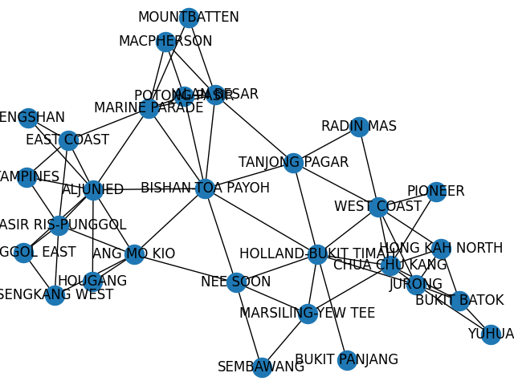
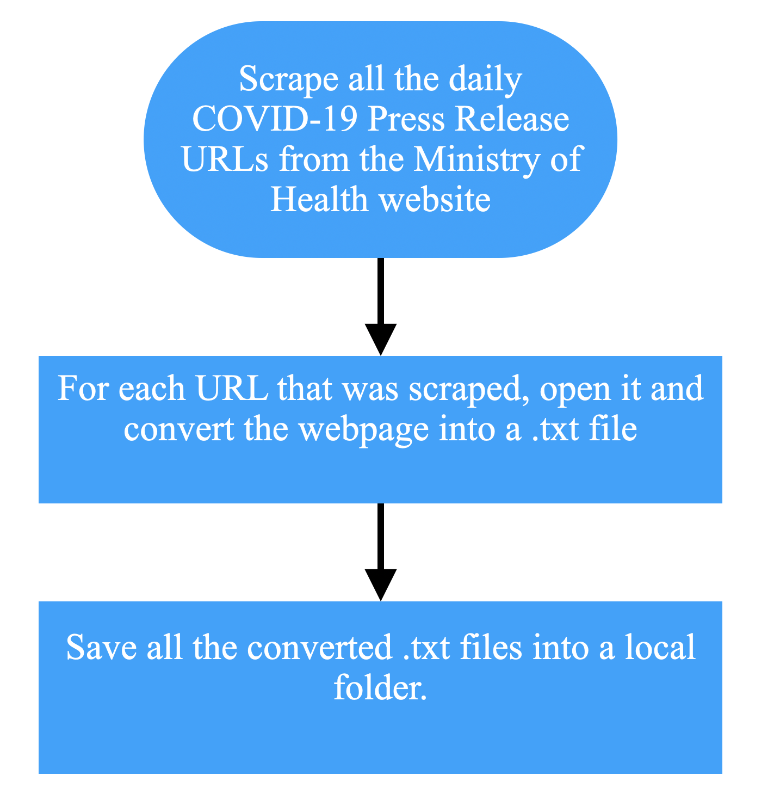
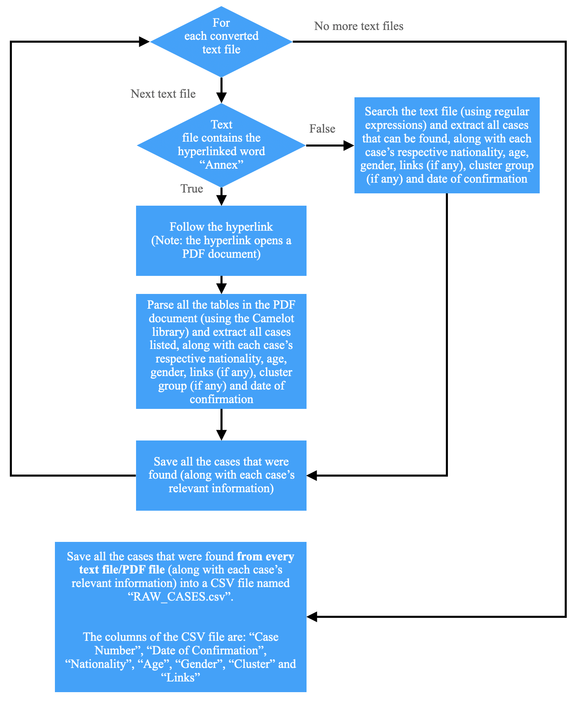
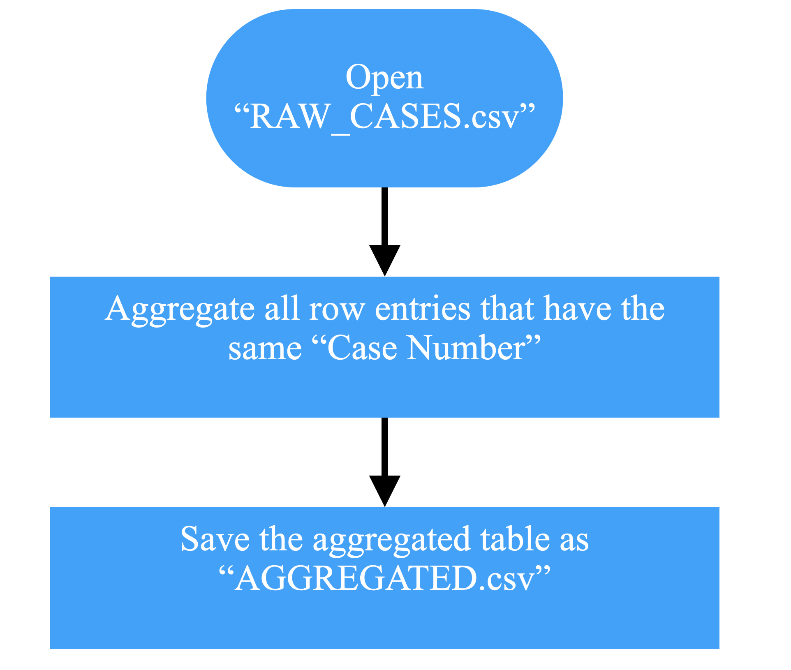
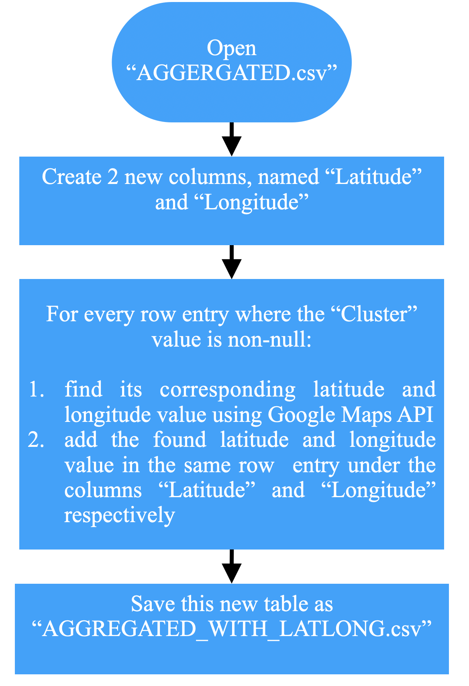
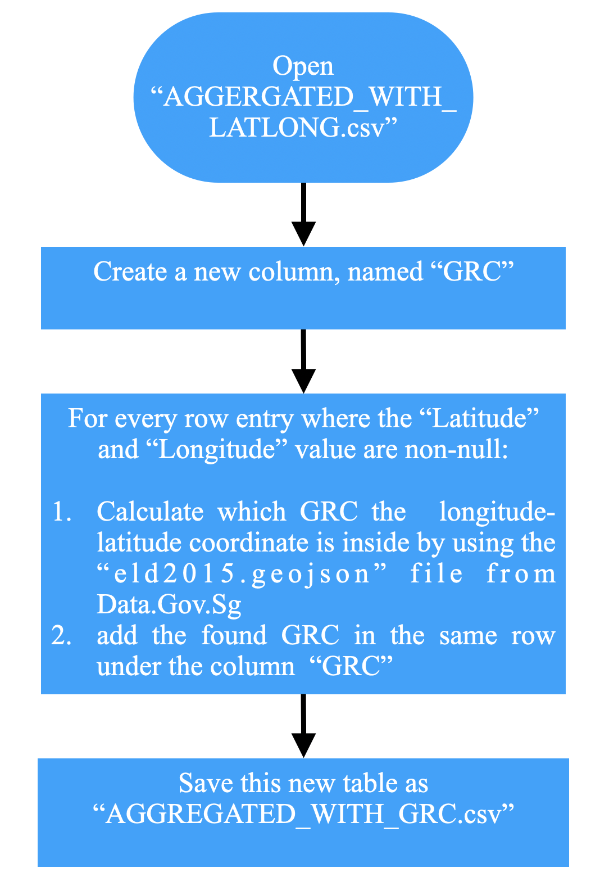
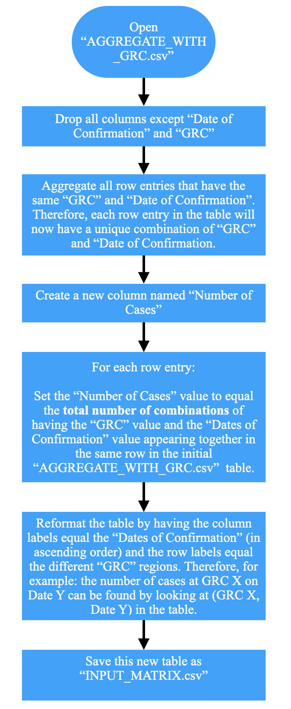
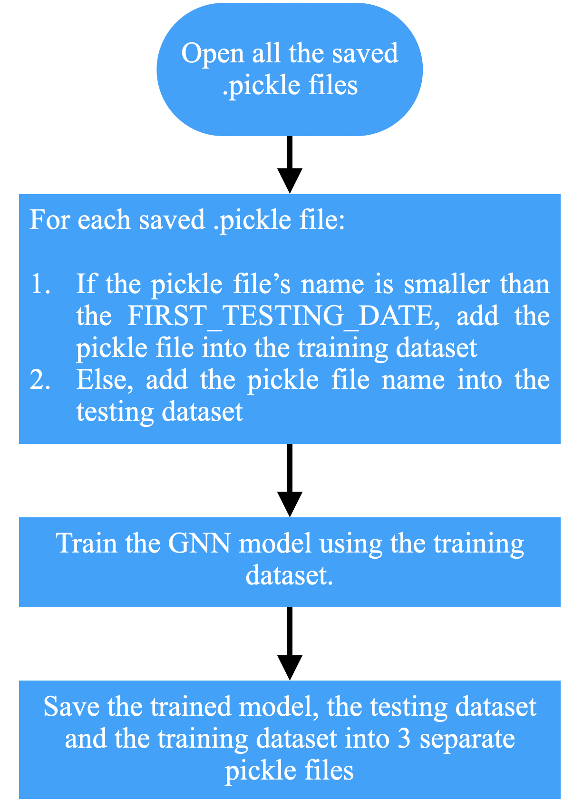
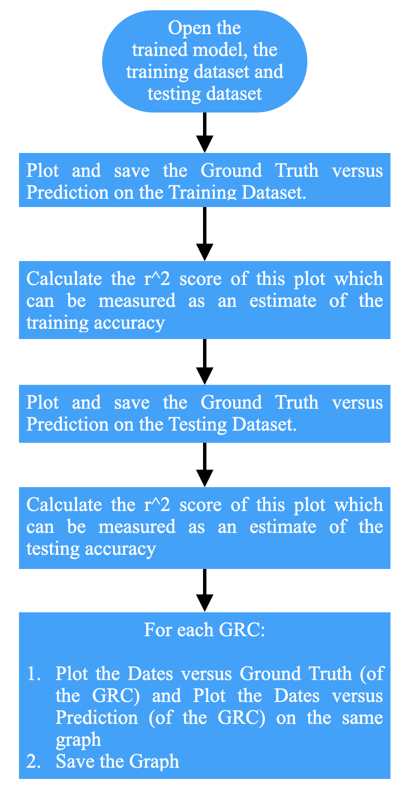
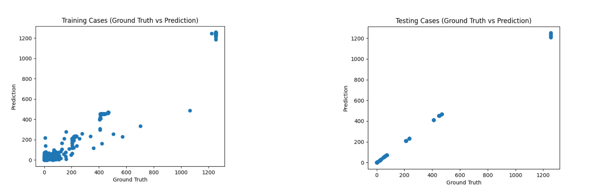

# Predicting future COVID-19 cases in different regions of Singapore using spatial temporal data

### GNN Model Used

To predict future COVID-19 cases in Singapore, I had decided to replicate an already-existing graph structure and GNN model created by five University of Illinois’ final-year undergraduate students (https://github.com/Inerix/gnn_covid19_spread) for predicting future COVID-19 cases in different states of the United States and Canada - since it was able to capturing general trends in each state quite well, albeit with some volatility. 

### Graph Structure

The graph was created where the nodes represent GRCs (Group Representation Constituencies) regions in Singapore. An edge exists between 2 nodes if the 2 GRCs are neighbours.

### GNN Model's Input and Output

* Input Tensor: The input tensor of the model is a 29x10x1 tensor. Since there are 29 GRCs and thus 29 nodes, each node will have 10x1 feature vector. This 10x1 feature vector is the total number of cases for the previous 10 days
* Output Vector: The output of the model is a 29x1 vector which gives the prediction of the total number of cases for the 11th day for each GRC

### GNN Model Layers

The GNN model used has 3 layers:
1. A modified Graph Convolutional Network (GCN) layer: The modified GCN layer takes the 29x10x1 tensor as input (mentioned above) and performs the graph convolution on the input data and then passes the aggregated data into a stack of 3 Long Short-Term Memory networks
2. A standard GCN layer
3. A final standard GCN layer which outputs the total number of cases for the 11th day for each GRC

### Project Pipeline

The project has many different sequential stages. Therefore, running each Python script accomplishes a particular stage:

1. get_moh_urls_and_save_text_files.py: Download and Save all the Daily COVID-19 Press Release Reports from the Ministry of Health Website (https://www.moh.gov.sg/covid-19/past-updates)  as text files

2. call_parser.py: Creates a Table from the downloaded text files. This table contains all relevant information about every published COVID-19 case (found in the Daily COVID-19 Press Release Reports) in Singapore; each row entry in the Table follows the following format: “Case Number”, “Date of Confirmation”, “Age”, “Gender”, “Cluster” and “Links” (all row entries must have a non-null “Case Number”)

3. aggregate_raw_cases.py: Aggregate all row entries in the Table that have the same ‘Case Number’. Therefore, each row entry in the Table will now have a unique ‘Case Number’.

4. add_latlong_columns.py: Adds “Latitude” and “Longitude” columns to the Table. Then, for every row entry: a “Latitude” and “Longitude" value is retrieved using Google Maps API - based on the “Cluster” address

5. add_grc_columns.py: Adds “GRC” columns to the Table. Then, for every row entry: a “GRC” value is calculated - based on the “Latitude” and “Longitude” values

6. create_number_of_cases_table.py: Reformats the Table by having the column labels equal the “Dates of Confirmation” (in ascending order) and the row labels equal the different “GRC” regions. Therefore, for example: the number of cases at GRC X on Date Y can be found by looking at (GRC X, Date Y) in the table. The reformatted Table should look like this:

7. create_grc_graph.py: Creates and saves all the 29x10x1 Feature Tensors (i.e the training examples) and corresponding 29x1 Label Vectors (i.e the training labels) that are needed to train the GNN model (Note: the Feature Tensor and corresponding Label Vector are created using the reformatted Table). Furthermore, it also creates and saves the graph where the nodes represents GRCs and an edge exists between 2 nodes if the 2 GRCs are neighbours

8.train_model.py: Train the GNN model (on the saved graph) with the saved Feature Tensors and the Label Vectors

9. evaluate_trained_model.py: Plots the Ground Truth (actual number of cases) versus Prediction (number of cases predicted by the model) for the training and testing dataset. The r^2 score (i.e the coefficient of determination) of the two plots can be used as a measure of the training and testing accuracy respectively. Furthermore, for every GRC: it plots the Dates versus Ground Truth and Dates versus Prediction on a single graph; this allows us to see how well the model predicts the number of cases for individual GRCs.

### Evaluation

By plotting the ground truth versus predictions on the testing dataset, I had received an r^2 score of ~ 0.898 (3 significant figures). And by plotting the ground truth versus prediction on the training dataset, I had received an r^2 score of ~0.998 (3 significant figures). Furthermore, from looking at plots of most GRCs, the predictions closely match the general trend direction of the actual number of cases. However, just like with the project done by the University of Illinois students, the predictions are volatile.

